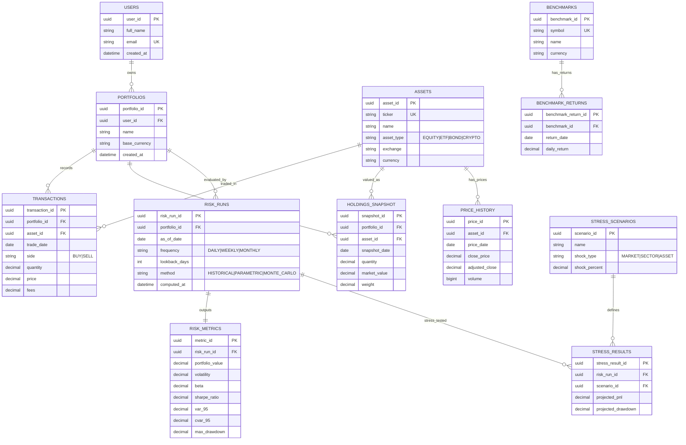

# Stock Portfolio Risk Analyzer ER Diagram 

```mermaid
erDiagram
    USERS {
        uuid user_id PK
        string full_name
        string email UK
        datetime created_at
    }

    PORTFOLIOS {
        uuid portfolio_id PK
        uuid user_id FK
        string name
        string base_currency
        datetime created_at
    }

    ASSETS {
        uuid asset_id PK
        string ticker UK
        string name
        string asset_type "EQUITY|ETF|BOND|CRYPTO"
        string exchange
        string currency
    }

    TRANSACTIONS {
        uuid transaction_id PK
        uuid portfolio_id FK
        uuid asset_id FK
        date trade_date
        string side "BUY|SELL"
        decimal quantity
        decimal price
        decimal fees
    }

    HOLDINGS_SNAPSHOT {
        uuid snapshot_id PK
        uuid portfolio_id FK
        uuid asset_id FK
        date snapshot_date
        decimal quantity
        decimal market_value
        decimal weight
    }

    PRICE_HISTORY {
        uuid price_id PK
        uuid asset_id FK
        date price_date
        decimal close_price
        decimal adjusted_close
        bigint volume
    }

    BENCHMARKS {
        uuid benchmark_id PK
        string symbol UK
        string name
        string currency
    }

    BENCHMARK_RETURNS {
        uuid benchmark_return_id PK
        uuid benchmark_id FK
        date return_date
        decimal daily_return
    }

    RISK_RUNS {
        uuid risk_run_id PK
        uuid portfolio_id FK
        date as_of_date
        string frequency "DAILY|WEEKLY|MONTHLY"
        int lookback_days
        string method "HISTORICAL|PARAMETRIC|MONTE_CARLO"
        datetime computed_at
    }

    RISK_METRICS {
        uuid metric_id PK
        uuid risk_run_id FK
        decimal portfolio_value
        decimal volatility
        decimal beta
        decimal sharpe_ratio
        decimal var_95
        decimal cvar_95
        decimal max_drawdown
    }

    STRESS_SCENARIOS {
        uuid scenario_id PK
        string name
        string shock_type "MARKET|SECTOR|ASSET"
        decimal shock_percent
    }

    STRESS_RESULTS {
        uuid stress_result_id PK
        uuid risk_run_id FK
        uuid scenario_id FK
        decimal projected_pnl
        decimal projected_drawdown
    }

    USERS ||--o{ PORTFOLIOS : owns
    PORTFOLIOS ||--o{ TRANSACTIONS : records
    ASSETS ||--o{ TRANSACTIONS : traded_in
    PORTFOLIOS ||--o{ HOLDINGS_SNAPSHOT : captures
    ASSETS ||--o{ HOLDINGS_SNAPSHOT : valued_as
    ASSETS ||--o{ PRICE_HISTORY : has_prices
    BENCHMARKS ||--o{ BENCHMARK_RETURNS : has_returns
    PORTFOLIOS ||--o{ RISK_RUNS : evaluated_by
    RISK_RUNS ||--|| RISK_METRICS : outputs
    RISK_RUNS ||--o{ STRESS_RESULTS : stress_tested
    STRESS_SCENARIOS ||--o{ STRESS_RESULTS : defines
```

